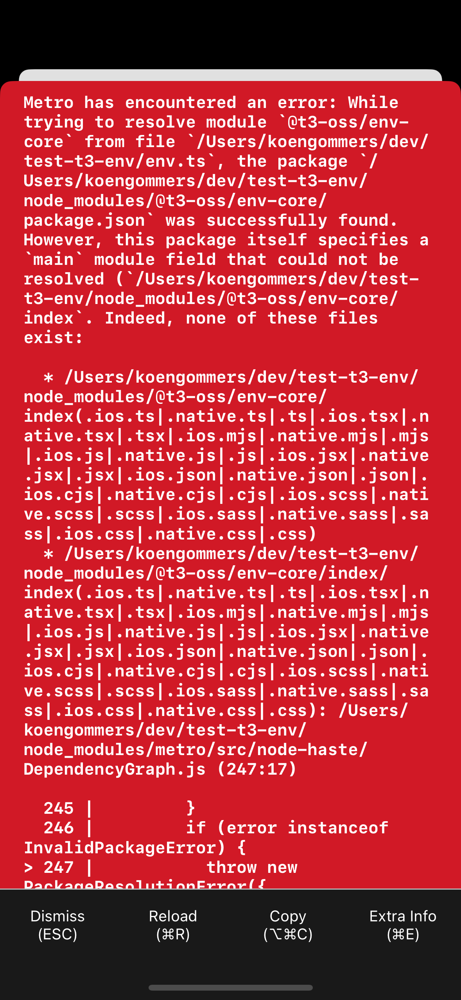

# T3 env in React Native issue

Importing @t3-oss/env-core gives an error, because support for Package Exports is disabled by default in Metro:

```
Metro has encountered an error: While trying to resolve module `@t3-oss/env-core` from file `/Users/koengommers/dev/test-t3-env/env.ts`, the package `/Users/koengommers/dev/test-t3-env/node_modules/@t3-oss/env-core/package.json` was successfully found. However, this package itself specifies a `main` module field that could not be resolved (`/Users/koengommers/dev/test-t3-env/node_modules/@t3-oss/env-core/index`. Indeed, none of these files exist:

  * /Users/koengommers/dev/test-t3-env/node_modules/@t3-oss/env-core/index(.ios.ts|.native.ts|.ts|.ios.tsx|.native.tsx|.tsx|.ios.mjs|.native.mjs|.mjs|.ios.js|.native.js|.js|.ios.jsx|.native.jsx|.jsx|.ios.json|.native.json|.json|.ios.cjs|.native.cjs|.cjs|.ios.scss|.native.scss|.scss|.ios.sass|.native.sass|.sass|.ios.css|.native.css|.css)
  * /Users/koengommers/dev/test-t3-env/node_modules/@t3-oss/env-core/index/index(.ios.ts|.native.ts|.ts|.ios.tsx|.native.tsx|.tsx|.ios.mjs|.native.mjs|.mjs|.ios.js|.native.js|.js|.ios.jsx|.native.jsx|.jsx|.ios.json|.native.json|.json|.ios.cjs|.native.cjs|.cjs|.ios.scss|.native.scss|.scss|.ios.sass|.native.sass|.sass|.ios.css|.native.css|.css): /Users/koengommers/dev/test-t3-env/node_modules/metro/src/node-haste/DependencyGraph.js (247:17)

  245 |         }
  246 |         if (error instanceof InvalidPackageError) {
> 247 |           throw new PackageResolutionError({
      |                 ^
  248 |             packageError: error,
  249 |             originModulePath: from,
  250 |             targetModuleName: to,

RCTFatal
__28-[RCTCxxBridge handleError:]_block_invoke
_dispatch_call_block_and_release
_dispatch_client_callout
_dispatch_main_queue_drain
_dispatch_main_queue_callback_4CF
__CFRUNLOOP_IS_SERVICING_THE_MAIN_DISPATCH_QUEUE__
__CFRunLoopRun
CFRunLoopRunSpecific
GSEventRunModal
-[UIApplication _run]
UIApplicationMain
main
start_sim
0x0
0x0
```


